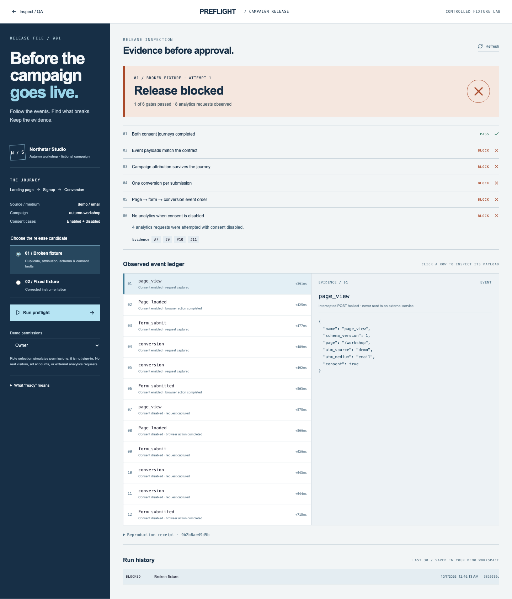

# Campaign Release Preflight

Campaign preflight follows one fictional Northstar workshop signup through a real Chromium browser. It records attempted analytics requests, evaluates a small event contract, and preserves the evidence behind a blocked or ready-for-review verdict.



The screenshot is captured by the [desktop browser test](../tests/e2e/preflight.spec.ts). Counts and timings are observations of the included fixture, not campaign results or production performance claims.

## Run and review

Use the repository's Node.js version and existing local setup:

```sh
npm ci
cp .env.example .env.local
npx playwright install chromium
npm run dev -- --hostname 127.0.0.1
```

Open [localhost:3000/preflight](http://localhost:3000/preflight), or choose **Campaign preflight** from Inspect. On Linux, `npx playwright install --with-deps chromium` can install the required system libraries. The browser installation requires network access; fixture execution does not need analytics services or credentials.

1. Keep **Broken fixture** selected and choose **Run preflight**.
2. Expand the blocked gates. Inspect the missing `utm_campaign`, string conversion value, duplicate conversion, and analytics requests attempted with consent disabled.
3. Select an event in the ledger to inspect its captured JSON. Sequence numbers link gate findings to evidence.
4. Select **Fixed fixture** and run again. All six gates should pass, with three analytics requests in the enabled journey and none in the disabled journey.
5. Reload, switch between history records, and inspect the reproduction receipt. Both results are saved in PostgreSQL/PGlite.
6. Select **Viewer**. Starting or retrying a run is disabled in the interface and rejected by the service. This is a permission simulation, not authentication.

A run that cannot finish is **FAILED**, never READY. If Chromium is missing, install it and choose **Retry failed run**. Retry creates a new job using the original available fixture version and variant, links it to the failed run, and retains the earlier evidence. A blocked run finished successfully as a test; choose the fixed candidate and start a new run rather than treating policy failures as infrastructure retries.

## The event contract

Each run opens two fresh browser contexts, one with analytics consent enabled and one disabled. Chromium loads the fixture and submits a form with `demo@example.invalid`. The email is neither collected nor stored in the analytics timeline.

| Event         | Required fields beyond the common envelope                                             |
| ------------- | -------------------------------------------------------------------------------------- |
| `page_view`   | None                                                                                   |
| `form_submit` | `form_id: "workshop-signup"`                                                           |
| `conversion`  | The same form ID, nonempty conversion ID, numeric nonnegative value, `currency: "USD"` |

The common envelope requires `schema_version: 1`, `page: "/workshop"`, and boolean consent matching the runner's actual case. Unknown fields are rejected. Attribution is checked separately: `utm_source=demo`, `utm_medium=email`, and `utm_campaign=autumn-workshop` must survive on every event. These are this fixture's contract, not a claim to implement GA4 or another vendor schema.

Six gates verify both completed browser journeys, payload schemas, attribution, exactly one enabled conversion, page/form/conversion event order, and zero analytics requests during the disabled journey. The verdict is computed from recorded observations, never selected from the fixture name. Empty or incomplete evidence cannot pass.

## Browser and network boundary

[fixture.ts](../src/lib/preflight/fixture.ts) contains the entire HTML and JavaScript. The runner accepts only `BROKEN` or `FIXED`; it does not accept a URL, HTML, script, event payload, or arbitrary campaign parameters from the client.

Playwright intercepts every request. It fulfills the exact fictional landing URL with the checked-in HTML and captures `POST https://campaign.example/collect` requests before returning a local 204. Everything else is aborted and fails the run. Service workers are blocked. The fixture performs real `fetch` calls, but none reach an analytics collector. The consent-disabled case is an explicit test input, not a cookie-consent vendor integration or legal compliance assessment.

The runner has a 15-second browser launch limit, a 25-second post-launch deadline, five-second browser-action waits, a 40-observation cap and a 4 KiB collector-payload cap. Browser contexts are closed in `finally`. Only trusted repository code executes; request interception is not a general sandbox for hostile JavaScript. Browser runtime background behavior and production egress containment would need separate operational controls.

## Queue and persistence

The existing `scans` table also stores `PREFLIGHT` jobs. Additive columns retain input and result snapshots; existing rows default to `WEBSITE`. The unique active-job index includes kind, allowing a website scan and campaign check to coexist for the Northstar sample site. Scanner reports and issue triage filter out campaign jobs.

The same runner entry point claims both kinds with `FOR UPDATE SKIP LOCKED`, a two-minute lease, and an incrementing attempt. Expired leases are retried up to three attempts. Completion is conditional on the current RUNNING attempt, so stale workers cannot overwrite later results. Explicit failures require a new retry job. At most 30 preflight runs are retained per workspace, pruned on enqueue; this is bounded demo history, not an immutable audit archive.

The default Next.js `after()` runner is best effort. Refresh requests can resume queued work. The existing separate worker supports PostgreSQL and must also have Chromium installed. Do not open the same PGlite directory from multiple processes. The schema initializer upgrades the prior local schema without deleting website records; it is not a versioned production migration framework. Run one initializer against an empty external database.

Each completed run saves fixture/policy versions, browser version, measured elapsed times, the observed timeline, individual gate evidence, and a SHA-256 fingerprint excluding elapsed times. That fingerprint helps compare repeated controlled runs; it is not a signature, proof of immutability, or performance benchmark. A retry rejects a fixture version no longer available in code.

## Implementation and verification

| File                                                                 | Responsibility                                              |
| -------------------------------------------------------------------- | ----------------------------------------------------------- |
| [fixture.ts](../src/lib/preflight/fixture.ts)                        | Broken/fixed fictional landing pages                        |
| [runner.ts](../src/lib/preflight/runner.ts)                          | Controlled Chromium journeys and intercepted requests       |
| [evaluate.ts](../src/lib/preflight/evaluate.ts)                      | Runtime schemas, evidence gates, deterministic fingerprint  |
| [service.ts](../src/lib/service.ts)                                  | Shared queue, snapshot persistence, retry checks, retention |
| [graphql.ts](../src/lib/graphql.ts)                                  | Typed queries/mutations and workspace/role context          |
| [preflight-workspace.tsx](../src/components/preflight-workspace.tsx) | Release brief, verdict, gate evidence, ledger and history   |

```sh
npm run check
npm run format:check
npm run test:preflight
npm run build
npm run test:e2e
# With a disposable PostgreSQL database:
TEST_DATABASE_URL=postgres://qa:qa@localhost:5432/qa npm test
```

[Service tests](../tests/preflight.test.ts) cover malformed/missing/misordered evidence, duplicates, consent and attribution faults, duplicate enqueue, cross-workspace access, viewer rejection, failed-run retries, exhausted leases, stale completion, bounded history, and preservation of legacy website data. [Real Chromium tests](../tests/preflight.browser.ts) verify both fixture variants and repeatable evidence. [Browser tests](../tests/e2e/preflight.spec.ts) exercise the actual UI → GraphQL → queue → browser runner → database → result flow on desktop and mobile. The separate failure-UI test uses an explicitly mocked storage/runner failure; lifecycle failure behavior is also tested against the service/database.

## Design and limits

Preflight uses a navy release brief, ruled inspection gates, a chronological event ledger, and a payload pane. It avoids reusing Inspect's metric-card dashboard. The original scanner interface remains intact. On narrow screens the brief, verdict, ledger, and payload stack; controls retain labels and visible focus states. No Lit component is needed for this bounded React workflow.

“Ready for review” means only that the included fixture passed this local policy. There is no deployment, approval override, release signing, ad platform connection, authenticated membership, arbitrary-site browser scan, third-party tag execution, session replay, or real-user telemetry. A trusted production system would need authentication, authorization, runner isolation, rate/resource limits, durable scheduling, migration/retention policy, and a campaign-specific reviewed event contract.
