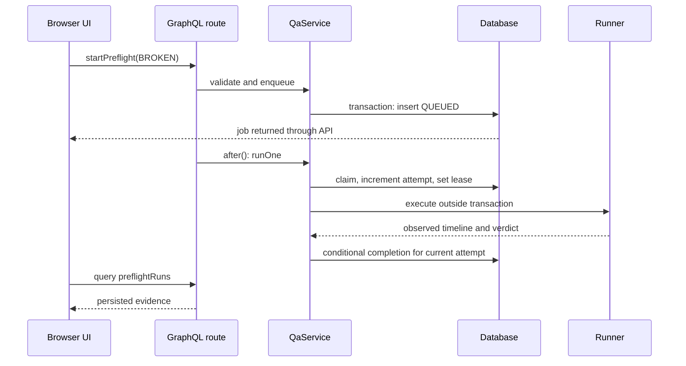

# Inspect technical manual

This is a code-reading and practice guide to the website scanner and Campaign Release Preflight in this repository. It describes implemented behavior, not a production service specification. Start with the [product scenario](product-story.md), then run the application before reading the queue internals.

## Learning route

1. Run both screens and explain what evidence each produces.
2. Trace one GraphQL mutation from the browser to a persisted job.
3. Explain why execution happens outside the claim transaction and why completion checks an attempt number.
4. Compare scanner fingerprints with preflight evidence receipts.
5. Reproduce a failed gate, a rejected mutation, and a worker failure.
6. Read the tests, then answer the exercises at the end without looking at their solutions.

The aim is to explain and modify the system with evidence. Reading this guide alone does not establish operational experience with a production scanner.

## 1. Run a reproducible local system

Use Node.js **22.13 or later** and the committed lockfile:

```sh
npm ci
npx playwright install chromium
npm run dev
```

Open `http://localhost:3000` for website QA and `http://localhost:3000/preflight` for campaign inspection. The website fixture scanner requires no Chromium; preflight does. No analytics account or API key is required. First initialization creates three fictional sites, six synthetic historical scans, and 30 issues. Those timestamps are demonstration history, not measurements collected over time.

The default database is embedded PGlite at `.data/qa`. Leave it owned by one Node process. A new browser cookie creates another workspace in the same database; it does not delete the earlier workspace.

| Variable            | Actual purpose                                                 | Local choice                         |
| ------------------- | -------------------------------------------------------------- | ------------------------------------ |
| `PGLITE_DATA_DIR`   | Embedded database directory when no external connection is set | `./.data/qa`                         |
| `DATABASE_URL`      | Select external PostgreSQL; required by the standalone worker  | Use your own local connection string |
| `ENABLE_LIVE_SCANS` | Enables public HTTP scanning only when exactly `true`          | Keep `false` for fixtures            |
| `APP_ORIGIN`        | Expected application origin for request checks behind a proxy  | Exact scheme and host of your app    |
| `TEST_DATABASE_URL` | External database used by service tests                        | A disposable test database only      |

See [`.env.example`](../.env.example). Never put real credentials in documentation, screenshots, or commits. Next.js reads `.env.local`; the standalone worker requires its environment to be supplied explicitly. The checked-in Docker Compose database uses demonstration credentials for local work only.

For an independent worker, start the local Compose database, set `DATABASE_URL` for the application, and export the same local connection in a second terminal before `npm run worker`. Do not point two processes at one PGlite directory. Initialize an empty external database with one process before starting concurrent workers; this project has an additive initializer, not a coordinated migration framework.

For a production-mode local run:

```sh
npm run build
npm start
```

This builds and serves locally. It does not deploy anything.

## 2. File map: where to answer a question

| Question                                                   | Source                                                                                                   |
| ---------------------------------------------------------- | -------------------------------------------------------------------------------------------------------- |
| What does the original screen request and render?          | [`dashboard.tsx`](../src/components/dashboard.tsx), [`client.ts`](../src/lib/client.ts)                  |
| How does preflight selection, polling, and history work?   | [`preflight-workspace.tsx`](../src/components/preflight-workspace.tsx)                                   |
| Where does HTTP become GraphQL context?                    | [`api/graphql/route.ts`](../src/app/api/graphql/route.ts)                                                |
| What operations and types exist?                           | [`graphql.ts`](../src/lib/graphql.ts)                                                                    |
| Who owns validation, queue claims, completion, and triage? | [`service.ts`](../src/lib/service.ts)                                                                    |
| How are transactions and storage selected?                 | [`database.ts`](../src/lib/database.ts), [`schema.ts`](../src/lib/schema.ts)                             |
| Which HTML checks and crawl rules run?                     | [`scanner.ts`](../src/lib/scanner.ts)                                                                    |
| What can a live request reach?                             | [`transport.ts`](../src/lib/transport.ts)                                                                |
| What fictional website responses exist?                    | [`fixtures.ts`](../src/lib/fixtures.ts)                                                                  |
| What browser page is tested?                               | [`preflight/fixture.ts`](../src/lib/preflight/fixture.ts)                                                |
| What requests does Chromium observe?                       | [`preflight/runner.ts`](../src/lib/preflight/runner.ts)                                                  |
| How is a verdict computed?                                 | [`preflight/evaluate.ts`](../src/lib/preflight/evaluate.ts), [`model.ts`](../src/lib/preflight/model.ts) |
| How does unattended polling work?                          | [`worker.ts`](../scripts/worker.ts)                                                                      |

Read these in request order rather than starting with all of `service.ts`.

## 3. Trace a request end to end

A browser calls `POST /api/graphql` with JSON. The route checks content type and origin, parses the body, obtains a UUID workspace from an HttpOnly cookie, and chooses a **simulated** role from `X-Demo-Role`. It initializes that workspace if necessary and passes a service and request-local DataLoader to Apollo.

Apollo checks the schema and operation restrictions. Resolvers delegate to `QaService`; service methods validate business inputs and issue parameterized, workspace-scoped SQL. GraphQL can return errors with HTTP 200, so the client checks both HTTP status and the `errors` array. An HTTP success alone is not proof that a mutation succeeded.

The route schedules `runOne(workspace)` through Next.js `after()`. A mutation returns a persisted queued record; it does not wait for the browser or crawl to finish. Queries can also trigger pending work. The UI refreshes to display saved state. On preflight, serial polling occurs while a queued or running job exists; it stops once no job is active.



### API experiments

Run this in your browser developer console while on the local app, so the workspace cookie is included:

```js
const response = await fetch('/api/graphql', {
  method: 'POST',
  headers: { 'Content-Type': 'application/json', 'X-Demo-Role': 'OWNER' },
  body: JSON.stringify({
    query: `mutation {
      startPreflight(input: { variant: FIXED }) {
        id status attempt input { variant fixtureVersion retryOf }
      }
    }`,
  }),
});
console.log(await response.json());
```

Then query the saved outcome; it may initially be queued or running:

```graphql
query InspectRuns {
  preflightRuns {
    id
    status
    attempt
    error
    input {
      variant
      fixtureVersion
      retryOf
    }
    preflight {
      verdict
      evidenceHash
      gates {
        id
        title
        passed
        evidence
        sequences
      }
      timeline {
        sequence
        consent
        kind
        name
        payload
      }
    }
  }
}
```

Other operations are `dashboard`, paginated `issues`, `currentRole`, `liveScansEnabled`, `addSite`, `startScan`, and `updateIssue`. The issue connection accepts 1–50 records, uses a base64url ID cursor, and sorts by stable ID, not recency. The main screen still uses the aggregate dashboard query. There is no generated client schema: handwritten operation types can drift and must be maintained alongside the API.

The custom validation rule allows at most 300 fields, rejects fragment definitions, and permits one root selection in a mutation operation. This deliberately small rule is not a production GraphQL cost model or rate limiter.

## 4. Storage model and invariants

| Table        | Responsibility                                                                       |
| ------------ | ------------------------------------------------------------------------------------ |
| `workspaces` | Cookie-scoped demo boundary and row used for serialization                           |
| `members`    | Fictional assignable people scoped to a workspace                                    |
| `sites`      | Site identity with JSONB payload                                                     |
| `scans`      | Both job kinds, status, lease, attempt, input, website result, or preflight evidence |
| `issues`     | Persistent human triage attached to a stable finding fingerprint                     |

Relational keys constrain workspace/site relationships. JSONB makes small payloads flexible but does not validate every nested field in the database. GraphQL and Zod validation remain important; direct SQL can bypass application invariants.

The scan `kind` separates `WEBSITE` from `PREFLIGHT`. Legacy scans default to `WEBSITE`. The additive upgrade creates the new active-job uniqueness index before removing its predecessor. A migration test starts from the old schema and verifies that existing rows survive. This is useful compatibility coverage; it is not a versioned migration or rollback system.

The partial unique index protects active `(workspace_id, site_id, kind)` jobs. Service locking adds policy: preflight permits only one active run per workspace, returning an existing identical request but rejecting a conflicting active request. Repeated enqueue is therefore narrowly deduplicated; there is no general client idempotency key.

Service mutations lock a workspace row to serialize conflicting changes. A dashboard read takes the same lock for a coherent service snapshot. This is easy to reason about at demonstration scale and limits throughput within one workspace. PostgreSQL can still process independent workspaces concurrently.

Website completion retains roughly 30 terminal runs per site; dashboard reads return at most 100 website scans. Preflight enqueue prunes terminal history to make room for the newest run and its list returns at most 30. Active work is retained. Issues themselves are not automatically archived, and anonymous workspaces do not expire.

### Read-only queue inspection

On a local PostgreSQL database, inspect metadata without dumping captured payloads:

```sql
SELECT kind, status, count(*)
FROM scans
GROUP BY kind, status
ORDER BY kind, status;

SELECT id, kind, status, attempt, lease_until, error
FROM scans
WHERE status IN ('QUEUED', 'RUNNING', 'FAILED')
ORDER BY created_at;
```

Use a disposable database for experiments that modify leases or rows. Never run fault-injection SQL against someone else's retained work.

## 5. Queue correctness: claim, work, publish

The lifecycle is `QUEUED → RUNNING → COMPLETED` or `FAILED`. A claim uses a short transaction with `FOR UPDATE SKIP LOCKED`, increments `attempt`, and grants a two-minute lease. The actual crawl or Chromium run happens after that transaction ends. Keeping a transaction open across network work would hold locks and database resources for an unpredictable duration.

Expired running work can be claimed again while fewer than three attempts have occurred. Expired jobs that have exhausted the limit fail visibly. An ordinary runner exception records `FAILED`; it is not silently retried forever.

The attempt number is a fencing token. Suppose worker A holds attempt 1, its lease expires, and worker B claims attempt 2. A later tries to publish. The completion predicate requires the current attempt and `RUNNING` state, so A's stale result cannot overwrite B's claim. The design tolerates repeated execution; it does **not** promise exactly-once execution.

Website completion locks the workspace and scan, updates issue records, computes comparison counts, and completes the scan transactionally. Preflight completion conditionally saves its independent result on the matching active attempt. Failure writes use the same attempt boundary.

`after()` is best effort. An idle or terminated application cannot guarantee queue progress. The PostgreSQL worker independently polls, sleeping when no job is available. Neither mode supplies production queue monitoring, dead-letter operations, distributed tracing, or guaranteed host lifetime.

A preflight retry is a **new** job pointing to a failed prior run in the same workspace. Its fixture variant and available version must match. Completed blocked runs are valid inspection results, not execution failures; run another variant rather than calling them failed jobs.

## 6. Website scanner: findings and their limits

`scanWebsite` first reads `/robots.txt`, then crawls sequentially. A 404 means no rules; other error statuses fail the robots check. It visits at most eight URLs, stores up to 32 queued links, returns at most 200 distinct findings, and checks a 35-second crawl budget between requests. An in-flight request can exceed that nominal total. Links must remain on the same origin and have no query string; the supplied starting URL can contain one.

`inspectHtml` uses Cheerio, not a browser. It checks response HTML for missing title, description, language, missing image `alt`, insecure `src`, and an editorial single-`h1` convention. HTTP error responses become findings. Empty `alt=""` is accepted for decorative images. A heading convention is not accessibility certification. JavaScript-rendered content, CSS resources, third-party links, and Core Web Vitals are outside this scanner.

A fingerprint hashes `rule + page URL + target`, separated by newlines, and takes 24 hexadecimal characters. That stable identity preserves the issue ID, first-seen time, assignee, note, and status across repeated observations. Evidence and last-seen time refresh. A changed target produces a new identity; there is no semantic DOM matching.

Comparison counts use the previous completed website scan's fingerprint set. **Not observed is not resolved**: a page may have been excluded or never reached. A previously resolved issue stays resolved if observed again. Automatic reopening would be a separate product policy, not a side effect hidden in the scanner.

### Network controls

The live transport permits HTTP/S standard ports without credentials, rejects local/private/reserved addresses, validates all DNS answers, and pins the selected public address into the socket lookup. Re-resolving after validation would create a DNS-rebinding gap. Redirects are revalidated and must stay on the original origin; at most three redirects are followed.

DNS waits are bounded at two seconds, HTTP requests at five seconds, response bodies at 1 MiB, and redirect chains have an additional elapsed-time check. Live scanning is opt-in. These controls reduce SSRF exposure but do not replace target authorization, an isolated worker, or a network egress firewall. See [security notes](security.md) before considering an exposed service.

## 7. Campaign preflight: observe first, evaluate second

The fixture is a fictional Northstar workshop signup. The only navigation is a checked-in page at `campaign.example`; the only accepted collector request is the exact local analytics POST endpoint. The runner intercepts and fulfills both locally. All other requests abort and fail the run; service workers are blocked. Callers choose a known variant and version, never arbitrary URLs or scripts.

Fresh browser contexts execute consent-enabled and consent-disabled journeys. The runner waits for page readiness, fills `demo@example.invalid`, submits the form, and waits for its completion marker. The email is not included in analytics payloads. Actual intercepted POST bodies form `EVENT` observations; completed browser steps form `ACTION` observations. An event may precede the action completion marker, so these markers are not input-start timestamps.

The broken fixture omits campaign attribution, duplicates a conversion, uses a string where a numeric value is expected, and emits events despite denied consent. The fixed fixture emits `page_view → form_submit → conversion` when consent is enabled and no analytics when disabled. Expected results are eight broken events and three fixed events.

The evaluator applies six gates:

| Gate             | Required evidence                                                                  |
| ---------------- | ---------------------------------------------------------------------------------- |
| Journey          | Page load and form submission completed in both consent cases                      |
| Schema           | Nonempty observed events all match strict event contracts and observation metadata |
| Attribution      | Every event carries the expected source, medium, and campaign                      |
| Conversion count | Exactly one consent-enabled conversion                                             |
| Order            | Enabled event names exactly match the expected three-event sequence                |
| Consent          | Completed disabled-consent actions with no disabled-consent events                 |

Zod validates event-specific strict schemas. Malformed JSON, primitives, null, extra fields, wrong value types, or metadata mismatches fail validation. Empty evidence cannot be ready. A run is `READY` only when all gates pass; otherwise it is `BLOCKED`. A crashed browser produces `FAILED` and no fabricated verdict.

The SHA-256 receipt includes the policy version and ordered observations with elapsed timings removed. Repeating identical content and order can therefore reproduce the hash despite timing differences. The result separately records browser, fixture, and policy versions. This is a comparison aid, not a digital signature, external collector receipt, or proof of tamper resistance.

The runner limits browser launch, waits, overall execution, event count, and payload size, then closes contexts/browser. It runs trusted checked-in code. Request interception is not an arbitrary-code security sandbox, and passing fixture gates does not prove that a real vendor accepted an event.

## 8. Identity, permissions, and UI honesty

Owner and Member can edit; Viewer is rejected by the service as well as disabled in the UI. The header is deliberately selectable by the client and the workspace cookie is not authenticated identity. An omitted or unknown role becomes Owner. These are demonstrations of authorization checks, not secure accounts or tenant isolation.

The preflight interface separates run status from policy verdict, displays saved evidence, allows old-run inspection, exposes retry failures, and labels a successful verdict **Ready for review**. It does not approve a campaign or deploy a release. The navy campaign workspace uses an event ledger and payload inspector; the original website screen organizes sites and issue triage. Their different layouts reflect different review tasks.

## 9. Validation ladder

Run the narrowest relevant check during editing; run the full sequence for a release candidate:

```sh
npm run format:check
npm run typecheck
npm test
npm run build
npm run test:preflight
npm run test:e2e
npm run benchmark
```

Browser tests require installed Chromium. The E2E configuration starts the production server, so build first and avoid an unrelated process on port 3000. External-database testing uses `TEST_DATABASE_URL` with a disposable PostgreSQL database; inspect the test setup before supplying any connection.

| Evidence                                                | What it establishes                                                                                        | What it does not establish                        |
| ------------------------------------------------------- | ---------------------------------------------------------------------------------------------------------- | ------------------------------------------------- |
| [`core.test.ts`](../tests/core.test.ts)                 | HTML rules, network policy, triage persistence, queue fencing, workspace behavior, pagination and batching | All public network environments are safe          |
| [`preflight.test.ts`](../tests/preflight.test.ts)       | Evaluator negatives, queue/retry/retention behavior and legacy schema preservation                         | A real browser ran each service test              |
| [`preflight.browser.ts`](../tests/preflight.browser.ts) | Chromium observes broken/fixed/repeated fixture results                                                    | Real campaign or vendor integration               |
| [`E2E tests`](../tests/e2e)                             | Desktop/mobile UI, API flow, history, Viewer behavior and error presentation                               | Complete accessibility conformance                |
| [`benchmark.ts`](../scripts/benchmark.ts)               | Naive owner resolution makes 30 member queries versus one batched query for the fixture                    | Production throughput or latency improvement      |
| [`CI workflow`](../.github/workflows/ci.yml)            | Formatting, types, embedded and PostgreSQL tests, build, real browser runner and E2E                       | Deployment success; this workflow does not deploy |

The UI failure tests include mocked API failures to verify presentation; the successful broken/fixed journeys and dedicated runner test execute real Chromium. Keep this distinction when discussing test coverage.

## 10. Failure labs and diagnosis

| Symptom                                   | First inspection                                         | Interpretation or recovery                                                    |
| ----------------------------------------- | -------------------------------------------------------- | ----------------------------------------------------------------------------- |
| Job remains queued                        | Saved status, app requests, worker logs, database choice | `after()` may not have run; use the PostgreSQL worker for independent polling |
| Browser launch failed                     | Error field and Chromium installation                    | Install the browser, then retry the failed preflight with its original input  |
| A blocked run cannot use failed-run retry | Status versus verdict                                    | `COMPLETED/BLOCKED` is successful execution with failed gates                 |
| Viewer mutation errors                    | GraphQL `errors` and selected role                       | Expected service enforcement; Owner/Member is a demo control                  |
| Data appears missing in another browser   | Workspace cookie                                         | A new workspace was seeded; original rows remain                              |
| PGlite lock error                         | Number of app/worker processes                           | One process per directory; use PostgreSQL for a separate worker               |
| Public scan rejects a redirect            | Requested versus final origin                            | Use the final authorized canonical origin; do not bypass validation           |
| Resolved issue appears in a later result  | Fingerprint and retained issue status                    | Observation and human resolution are intentionally independent                |
| Receipt differs between runs              | Policy and ordered payloads, not just timing             | Changed content/order changes the receipt; elapsed time is excluded           |

For repeatable failure practice, run the negative cases in `tests/preflight.test.ts` and the UI error test rather than breaking your working database. The service accepts an injected runner, allowing a test to throw without deleting Chromium or altering global configuration. Lease-expiration tests use disposable state to prove stale completion is ignored.

## 11. Engineering choices and safe extension points

- **Add an HTML rule:** implement it in `inspectHtml`, choose stable rule/target identity, add positive and negative examples, and explain what the rule cannot establish. Avoid converting heuristics into compliance claims.
- **Add an analytics event:** update the fixture, strict schema, sequence policy, GraphQL-facing expectations, and real browser test together. Decide whether the policy and fixture versions must change; do not reinterpret old saved evidence silently.
- **Add authenticated accounts:** replace client-selected role/workspace context with verified identity and server-owned membership. Add cross-account tests, quotas, expiry, and auditing before claiming secure tenancy.
- **Add a new job type:** separate its payload/result, filtering, retention, dispatch, and completion conditions. Keep old website results and preflight evidence independent.
- **Scale execution:** external PostgreSQL and independent workers are the current foundation. Before exposing it, design worker isolation, egress restrictions, observability, backpressure, fair scheduling, and retention. None is supplied merely by using `SKIP LOCKED`.
- **Integrate a real collector:** define authorization, permitted targets, data minimization, consent policy, and external delivery evidence first. Current local request capture does not implement that integration.

## 12. Exercises with answers

### A. Follow one piece of evidence

Run Broken fixture, select the consent gate, and inspect its referenced sequence numbers. Which observation proves the gate failure? Is a status label alone enough?

**Answer:** a consent-disabled `EVENT` proves emission during the disabled journey; inspect its raw payload and observation metadata. Completed actions establish that the journey occurred. The verdict label is a summary, not the underlying evidence.

### B. Explain a stale worker

Attempt 1 finishes after attempt 2 has been claimed. What prevents attempt 1 from publishing? Would a lease timestamp alone be sufficient?

**Answer:** completion matches current `attempt` and `RUNNING` state. A timestamp signals eligibility for reclaim but is not ownership proof after another claim; the incremented attempt fences stale results. Execution can still happen twice.

### C. Preserve triage

Assign an issue, add a note, resolve it, and rescan. Predict its owner, note, ID, status, and comparison category.

**Answer:** for the same fingerprint, owner/note/ID/status remain; it is recurring if present in the prior completed scan. It can be both recurring and manually resolved. See the completion upsert and core persistence test.

### D. Test attribution independently

In a disposable test branch, supply otherwise valid events with one missing `utm_campaign`. Which gate should fail? Why not reject all missing UTM fields in the event schema alone?

**Answer:** attribution fails. Structural event validation and campaign policy are separate concerns: optional campaign fields can still form a structurally valid event. The separate gate gives a more precise explanation. Never change committed fixtures merely to make a failing policy appear green.

### E. Distinguish hashing purposes

Why is the finding fingerprint short and based on rule/URL/target, while the preflight receipt hashes the timeline? Does either authenticate the author?

**Answer:** fingerprints correlate findings across scans despite evidence text changes. The receipt compares ordered captured content under a policy version, ignoring timings. Neither authenticates an author; no signing key or trust protocol exists.

### F. Diagnose N+1

Run `npm run benchmark`. Explain why a request-local loader is safer than one global loader.

**Answer:** batching combines member lookups for one request and maps results back to requested IDs. A global cache could return another workspace's data or stale member information. The demonstrated 30-to-1 count concerns member queries only, not all SQL or measured user latency.

### G. Improve one boundary

Design a production-ready replacement for the simulated role header. List three tests you would add before calling it authentication.

**Answer:** use verified sessions and server-side workspace membership, then test unauthenticated rejection, a real Viewer attempting a mutation despite forged headers, and one authenticated user's access to another workspace's IDs. Also test revocation and expired sessions. This is a proposed extension, not implemented behavior.

## 13. Interview questions to answer from code

**Why GraphQL?** The UI requests related sites, scans, issues and owners in one typed graph. It is a convenient boundary, not an automatic solution to N+1, authentication, or caching. Point to the explicit DataLoader and service checks.

**Why two scanner modes?** Website scanning inspects bounded response HTML through a guarded transport. Campaign preflight executes only trusted local fixtures in Chromium to observe JavaScript events. Their different trust boundaries justify separate runners and results.

**How do you handle retries?** Lease recovery permits repeated execution with attempt fencing; ordinary failed preflight retries create linked new jobs with validated snapshots. Explain both rather than claiming exactly-once processing.

**What is the most important product limitation?** A partial scan cannot prove a site is correct, and fixture evidence cannot approve a real campaign. The UI and data model preserve those distinctions.

**What would you change first for a public service?** Verified identity, quotas, upstream request limits, isolated workers/egress, durable operations and retention. These are missing requirements, not hidden capabilities.

**How do you know the happy path works?** Cite the actual service, PostgreSQL, Chromium and desktop/mobile tests plus a specific CI run. Avoid presenting screenshots or a green badge as proof of every behavior.

Continue with [architecture](architecture.md), [security](security.md), and the [campaign contract and walkthrough](campaign-preflight.md).
